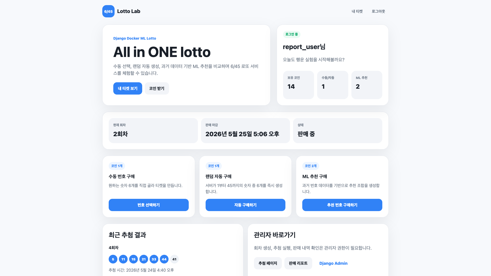
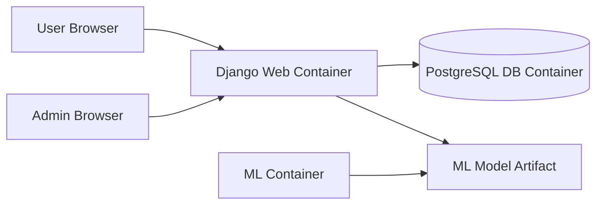
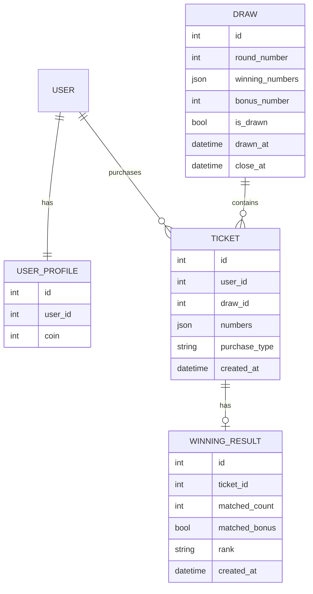
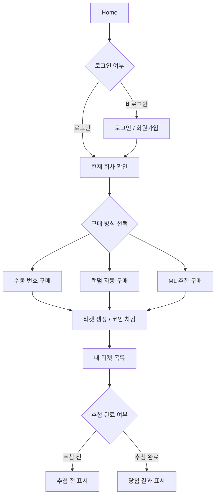
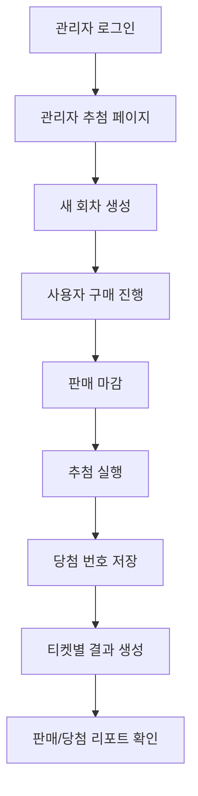
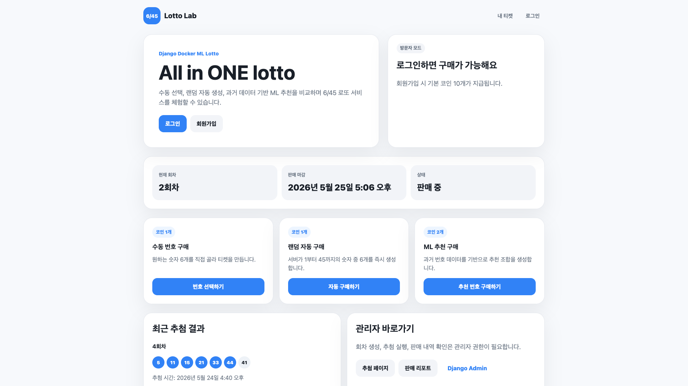
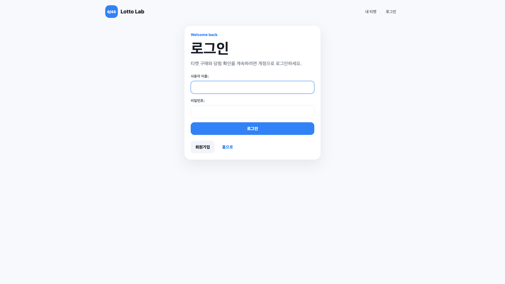
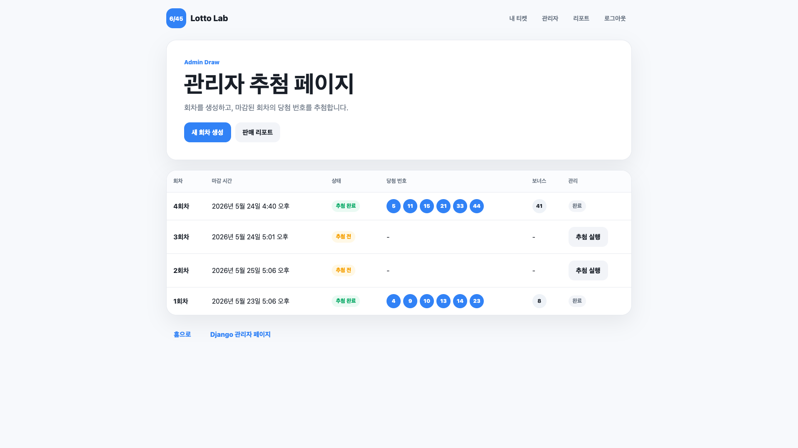
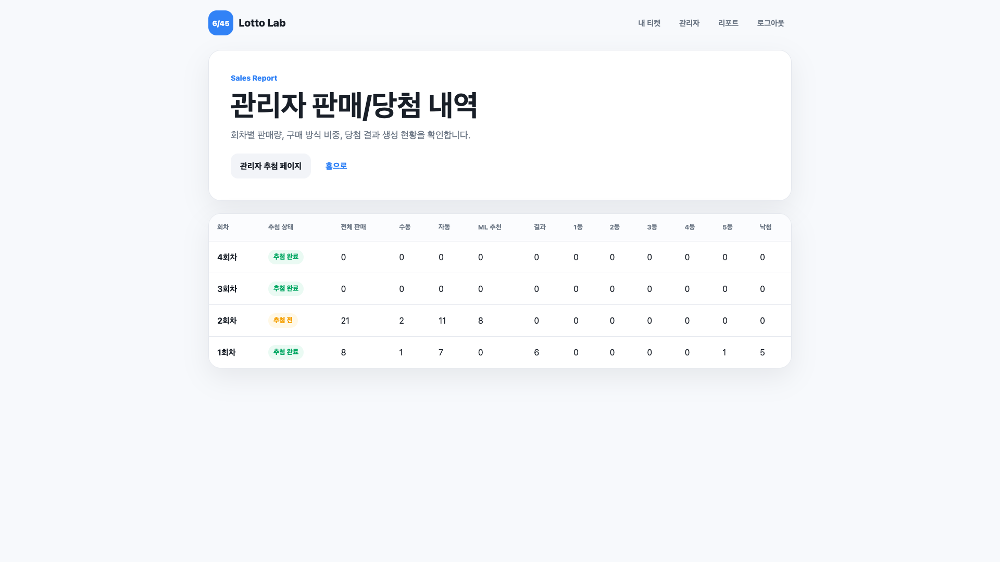

# Lotto Lab

> Django와 Docker multi-container 환경으로 구현한 6/45 로또 웹 서비스입니다.  
> 일반 사용자는 수동 번호, 랜덤 자동 번호, ML 추천 번호로 티켓을 구매할 수 있고, 관리자는 회차 생성, 추첨 실행, 판매/당첨 내역 확인을 수행할 수 있습니다.



## 프로젝트 개요

Lotto Lab은 Django와 Docker를 학습하기 위한 과제 프로젝트입니다. 단순 CRUD 구현을 넘어서, 실제 웹 서비스 구조를 경험하기 위해 사용자 기능, 관리자 기능, PostgreSQL 연동, ML 추천 기능, 보고서용 화면 캡처까지 포함했습니다.

핵심 목표는 다음과 같습니다.

- Django MTV 패턴, ORM, Form, Auth, Template 구조 이해
- Docker Compose 기반 multi-container 서비스 구성
- PostgreSQL 컨테이너와 Django 웹 컨테이너 연결
- ML 모델 결과물을 Django 서비스에 연결하는 백엔드 흐름 경험
- 시스템 설계, 구현 과정, 테스트 결과, AI 사용 내역을 보고서로 정리

## 주요 기능

### 사용자 기능

- 회원가입 / 로그인 / 로그아웃
- 현재 진행 중인 회차 확인
- 보유 코인 확인
- 수동 번호 구매
- 랜덤 자동 번호 구매
- ML 추천 번호 구매
- 내 티켓 목록 확인
- 추첨 완료 후 당첨 결과 확인
- 가상 광고 시청 후 코인 보상

### 관리자 기능

- 관리자 전용 추첨 페이지 접근
- 새 회차 생성
- 마감된 회차 추첨 실행
- 당첨 번호 및 보너스 번호 생성
- 티켓별 당첨 결과 자동 생성
- 회차별 판매/당첨 리포트 확인
- Django Admin을 통한 모델 데이터 관리

## 기술 스택

| 영역 | 기술 |
|---|---|
| Backend | Python, Django |
| Database | PostgreSQL |
| Infra | Docker, Docker Compose |
| ML | pandas, scikit-learn, joblib |
| Frontend | Django Template, HTML, CSS |
| UI Style | Toss 스타일의 카드형 인터페이스 |

## Docker Multi-container 구조

```text
docker-compose.yml
├── web  : Django application server
├── db   : PostgreSQL database
└── ml   : ML training / experiment container
```



컨테이너를 분리한 이유는 다음과 같습니다.

- Django 서버와 DB의 책임을 분리하기 위해
- PostgreSQL 데이터를 volume으로 영속화하기 위해
- ML 학습 환경을 웹 서버 실행 환경과 분리하기 위해
- 실제 서비스 구조와 유사한 실행 환경을 경험하기 위해

## 프로젝트 구조

```text
lotto/
├── config/                    # Django project settings
├── lotto/                     # Main Django app
│   ├── models.py              # Draw, Ticket, UserProfile, WinningResult
│   ├── views.py               # Request handling
│   ├── services.py            # Business logic
│   ├── ml_service.py          # ML recommendation logic
│   ├── forms.py               # Django forms
│   ├── templates/lotto/       # HTML templates
│   └── static/lotto/          # CSS
├── ml/                        # ML data / training scripts / model artifact
├── report/                    # Project report and screenshots
├── docker-compose.yml
├── Dockerfile
├── Dockerfile.ml
├── requirements.txt
└── manage.py
```

## 데이터 모델



## 사용자 플로우



## 관리자 플로우



## 화면 예시

### 홈 화면



### 로그인


### 내 티켓 목록



### 관리자 추첨 페이지



### 판매/당첨 리포트



## 실행 방법

### 1. 저장소 클론

```bash
git clone https://github.com/carolyn0515/lotto.git
cd lotto
```

### 2. 환경변수 설정

프로젝트 루트에 `.env` 파일을 생성합니다.

```env
DEBUG=True
SECRET_KEY=django-insecure-local-dev-key

POSTGRES_DB=lotto_db
POSTGRES_USER=lotto_user
POSTGRES_PASSWORD=lotto_password
POSTGRES_HOST=db
POSTGRES_PORT=5432
```

### 3. Docker 컨테이너 실행

```bash
docker compose up --build
```

서비스 실행 후 브라우저에서 접속합니다.

```text
http://127.0.0.1:8000/
```

### 4. Migration 실행

새 터미널에서 실행합니다.

```bash
docker compose exec web python manage.py migrate
```

### 5. 관리자 계정 생성

```bash
docker compose exec web python manage.py createsuperuser
```

관리자 페이지:

```text
http://127.0.0.1:8000/admin/
```

## ML 추천 기능

ML 추천 기능은 과거 당첨 번호 데이터를 기반으로 번호별 feature를 생성하고, 학습된 모델의 확률값을 이용해 추천 번호를 생성합니다.

사용한 feature 예시는 다음과 같습니다.

- 최근 5회 등장 횟수
- 최근 10회 등장 횟수
- 최근 20회 등장 횟수
- 전체 등장 횟수
- 마지막 등장 이후 지난 회차 수
- 홀수 여부
- 번호 구간 그룹

단, 로또 번호는 본질적으로 무작위 추첨이므로 ML 추천 기능은 실제 당첨을 보장하지 않습니다. 본 프로젝트에서 ML은 당첨 예측이 아니라, 자동 번호 생성 방식을 다양화하기 위한 실험적 기능입니다.

## 테스트 및 검증

```bash
docker compose exec web python manage.py check
docker compose exec web python manage.py test
```

검증한 주요 시나리오:

| 시나리오 | 결과 |
|---|---:|
| 회원가입 / 로그인 | 통과 |
| 수동 번호 구매 | 통과 |
| 랜덤 자동 구매 | 통과 |
| ML 추천 구매 | 통과 |
| 회차 생성 | 통과 |
| 추첨 실행 | 통과 |
| 내 티켓 결과 확인 | 통과 |
| 관리자 판매 리포트 확인 | 통과 |

## 보고서

상세한 시스템 설계, 구현 과정, 테스트 결과, 화면 캡처, AI 도구 사용 내역은 아래 보고서에 정리했습니다.

[프로젝트 보고서 보기](report/PROJECT_REPORT.md)

보고서용 화면 캡처는 `report/images/`에 저장되어 있습니다.

## AI 도구 사용 내역

본 프로젝트에서는 AI 도구를 제한적인 보조 목적으로 사용했습니다.

| 사용 영역 | 내용 |
|---|---|
| 코드 점검 | Django View, 서비스 로직, ML 의존성 import 구조, 관리자 리포트 집계 로직 점검 |
| 디자인 개선 | 기본 HTML 화면을 Toss 스타일 카드형 UI로 개선 |
| 문서 정리 | 보고서 구조, 다이어그램, 화면 캡처 설명 정리 |

핵심 기능 구현, Docker/Django 학습, 실행 확인, 오류 수정 여부 판단은 직접 수행했습니다.

## GitHub

[https://github.com/carolyn0515/lotto](https://github.com/carolyn0515/lotto)

## 추가 개선 방향

- Django TestCase 기반 자동화 테스트를 추가하면 기능 검증 범위를 더 넓힐 수 있음
- 실제 로또 공개 데이터 수집 자동화 가능
- Celery와 Redis를 활용한 ML 학습 비동기 처리 가능
- 관리자 통계 차트 및 대시보드 시각화 개선 가능
- REST API와 React/Vue 프론트엔드 분리 구조로 확장 가능
