# Django & Docker 기반 6/45 Lotto Lab 웹 서비스 개발 보고서

## 1. 프로젝트 개요

### 1.1 프로젝트명

**Lotto Lab: Django, Docker, ML 추천 기능을 포함한 6/45 로또 웹 서비스**

### 1.2 개발 배경

본 프로젝트는 Django와 Docker를 활용하여 일반 사용자와 관리자가 함께 사용하는 6/45 로또 웹 서비스를 구현하는 것을 목표로 한다. 기본 요구사항은 사용자의 복권 구매 및 당첨 확인, 관리자의 판매 내역 확인 및 추첨 기능 제공이다. 여기에 과거 당첨 번호 데이터를 기반으로 한 ML 추천 구매 기능을 확장하여, 단순 CRUD 웹 애플리케이션을 넘어 **데이터 기반 추천 기능이 포함된 백엔드 서비스**로 발전시켰다.

프로젝트는 단순히 기능을 완성하는 데 그치지 않고, 다음 세 가지 학습 목표를 중심으로 설계하였다.

- Django MTV 패턴과 ORM을 이용한 웹 서비스 구현
- Docker Compose를 이용한 multi-container 서비스 환경 구성
- ML 모델 산출물을 Django 서비스에 연결하는 백엔드 서빙 구조 경험

특히 본 과제의 핵심은 Django와 Docker를 직접 학습하고 적용하는 데 있으므로, 구현 과정에서 단순히 결과 화면을 만드는 것보다 **웹 요청 처리 흐름, 모델 설계, 컨테이너 간 연결, 환경변수 관리, DB 영속성 구성**을 이해하는 데 중점을 두었다.

### 1.3 핵심 컨셉

Lotto Lab은 사용자가 세 가지 방식으로 로또 티켓을 구매할 수 있는 서비스이다.

| 구매 방식 | 설명 | 차감 코인 |
|---|---:|---:|
| 수동 번호 구매 | 사용자가 1~45 사이 번호 6개를 직접 입력 | 1개 |
| 랜덤 자동 구매 | 서버가 무작위로 번호 6개를 생성 | 1개 |
| ML 추천 구매 | 과거 번호 데이터를 기반으로 추천 번호 생성 | 2개 |

단, ML 추천 기능은 실제 당첨을 보장하는 예측 기능이 아니다. 로또 번호는 본질적으로 무작위 추첨이므로, 본 프로젝트의 ML 기능은 “과거 데이터를 기반으로 한 추천 방식의 다양화”를 목적으로 한다. 이 점은 서비스 설명과 보고서에 명확히 분리하여 기술하였다.

---

## 2. 요구사항 분석

### 2.1 과제 요구사항

| 구분 | 요구사항 | 구현 여부 |
|---|---|---:|
| 사용자 기능 | 복권 구매 | 구현 |
| 사용자 기능 | 수동 번호 구매 | 구현 |
| 사용자 기능 | 자동 번호 구매 | 구현 |
| 사용자 기능 | 당첨 확인 | 구현 |
| 관리자 기능 | 판매 내역 확인 | 구현 |
| 관리자 기능 | 추첨 기능 | 구현 |
| 관리자 기능 | 당첨 내역 확인 | 구현 |
| 인프라 | Docker multi-container 구성 | 구현 |
| 보고서 | 시스템 설계, 구현 과정, 테스트 결과 기록 | 작성 |
| 기타 | GitHub 링크 명시 | 작성 위치 포함 |
| 기타 | AI 도구 사용 내역 명시 | 작성 |

### 2.2 학습 중심 요구사항 해석

본 과제는 기능 구현뿐 아니라 Django와 Docker를 사용해 서비스를 구성하는 과정을 이해하는 것이 중요하다. 따라서 요구사항을 다음과 같이 학습 목표로 재해석하였다.

| 과제 요구사항 | 학습 관점 | 프로젝트 반영 내용 |
|---|---|---|
| Django 사용 | MTV 구조와 ORM 이해 | `models.py`, `views.py`, `templates`, `forms.py` 역할 분리 |
| 복권 구매 기능 | HTTP 요청과 서버 측 검증 이해 | POST 요청, CSRF, Form 검증, `login_required` 적용 |
| 관리자 기능 | 권한 제어와 데이터 운영 흐름 이해 | `staff_member_required`, Django Admin, 관리자 전용 리포트 구현 |
| Docker 사용 | 컨테이너 기반 실행 환경 이해 | `web`, `db`, `ml` 컨테이너 분리 |
| multi-container 구성 | 서비스 간 의존성과 네트워크 이해 | Django 컨테이너가 PostgreSQL 컨테이너에 접속하도록 구성 |
| 테스트 결과 기록 | 기능 검증 절차 이해 | system check, template loading check, 브라우저 기반 수동 테스트 기록 |
| AI 사용 내역 명시 | 개발 보조 도구 사용 범위 구분 | 코드 점검 및 UI 디자인 개선 보조로 사용 범위 작성 |

### 2.3 확장 요구사항

기본 요구사항에 더해 다음 기능을 추가로 구현하였다.

| 확장 기능 | 목적 |
|---|---|
| ML 추천 번호 구매 | 과거 데이터 기반 추천 기능 제공 |
| 코인 시스템 | 구매 비용과 광고 보상 흐름 구현 |
| 가상 광고 보상 | 사용자가 코인을 얻는 흐름 제공 |
| 관리자 판매 리포트 | 회차별 판매량과 구매 방식별 통계 확인 |
| Toss 스타일 UI | 사용자 경험 개선 및 프로젝트 완성도 향상 |

---

## 3. 전체 시스템 아키텍처

### 3.1 아키텍처 개요

본 프로젝트는 Django 애플리케이션, PostgreSQL 데이터베이스, ML 작업 컨테이너를 Docker Compose로 구성한다. 웹 애플리케이션은 사용자 요청을 처리하고, DB는 회차, 티켓, 사용자 프로필, 당첨 결과 데이터를 저장한다. ML 컨테이너는 모델 학습 및 실험을 위한 독립 환경으로 분리하였다.

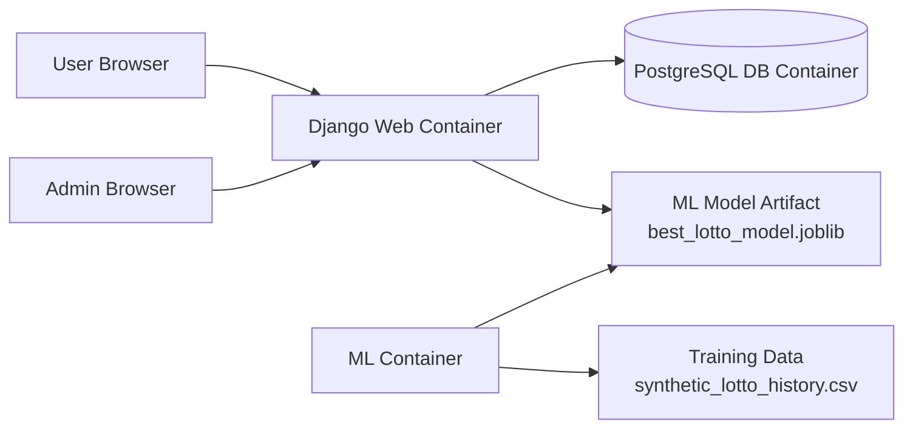

### 3.2 Docker Compose 구성

| 컨테이너 | 역할 |
|---|---|
| `web` | Django 웹 서버 실행 |
| `db` | PostgreSQL 데이터 저장소 |
| `ml` | ML 모델 학습 및 실험용 컨테이너 |

`web` 컨테이너는 Django 프로젝트를 실행하며, `db` 컨테이너는 PostgreSQL 15 이미지를 사용한다. `ml` 컨테이너는 웹 서버와 분리된 환경에서 모델 학습 스크립트를 실행할 수 있도록 구성하였다.

```yaml
services:
  web:
    build: .
    command: python manage.py runserver 0.0.0.0:8000
    depends_on:
      - db

  db:
    image: postgres:15

  ml:
    build:
      dockerfile: Dockerfile.ml
```

### 3.3 Docker 학습 내용

이번 프로젝트를 통해 Docker를 단순 실행 도구가 아니라, 서비스 실행 환경을 코드로 정의하는 도구로 이해할 수 있었다. 로컬 PC에 직접 PostgreSQL, Python 패키지, ML 패키지를 섞어서 설치하는 대신, 각 역할별 컨테이너를 분리함으로써 실행 환경의 재현성과 구조적 명확성을 확보하였다.

| 학습 항목 | 적용 내용 | 이해한 점 |
|---|---|---|
| Dockerfile | Django 서버 이미지 빌드 | 애플리케이션 실행에 필요한 Python 환경과 의존성을 이미지로 고정 |
| Docker Compose | `web`, `db`, `ml` 컨테이너 동시 실행 | 여러 컨테이너를 하나의 서비스 단위로 관리 |
| `depends_on` | `web`이 `db` 이후 실행되도록 설정 | 컨테이너 실행 순서와 서비스 의존성 이해 |
| volume | PostgreSQL 데이터와 프로젝트 파일 유지 | 컨테이너가 재시작되어도 데이터와 코드 변경을 보존 |
| env_file | `.env`로 DB 접속 정보 관리 | 설정값과 코드를 분리하는 방식 이해 |
| port mapping | `8000:8000`, `5432:5432` | 호스트와 컨테이너 네트워크 연결 방식 이해 |

### 3.4 Multi-container 구성 이유

단일 컨테이너에 Django와 DB를 모두 넣는 방식도 가능하지만, 본 프로젝트에서는 과제 요구사항에 맞게 multi-container 구조를 사용하였다. 이 구조는 실제 서비스 운영 방식에 더 가깝다.

- `web`: 사용자 요청 처리, 화면 렌더링, 비즈니스 로직 수행
- `db`: 회차, 티켓, 사용자, 당첨 결과 데이터 저장
- `ml`: 모델 학습 및 실험 환경 제공

이렇게 분리하면 웹 서버를 수정하더라도 DB 데이터를 유지할 수 있고, ML 학습 환경을 웹 서버와 독립적으로 관리할 수 있다. 또한 컨테이너별 책임이 명확해져 장애 원인을 추적하기 쉽다.

### 3.5 설계 의도

이 구조는 실무 환경의 관심사 분리 원칙을 따른다.

- Django는 웹 요청, 인증, 비즈니스 로직, 템플릿 렌더링 담당
- PostgreSQL은 영속 데이터 저장 담당
- ML 컨테이너는 모델 학습 및 실험 담당
- Django 서비스는 학습된 모델 파일을 로드하여 추천 결과만 서비스에 반영

즉, 모델 학습과 웹 요청 처리를 한 프로세스에 섞지 않고, 최소한의 역할 분리를 적용하였다.

---

## 4. 프로젝트 구조

```text
lotto/
├── config/
│   ├── settings.py
│   ├── urls.py
│   └── wsgi.py
├── lotto/
│   ├── models.py
│   ├── views.py
│   ├── urls.py
│   ├── forms.py
│   ├── services.py
│   ├── ml_service.py
│   ├── templates/lotto/
│   └── static/lotto/styles.css
├── ml/
│   ├── data/
│   ├── model/
│   ├── build_features.py
│   ├── generate_synthetic_data.py
│   └── train_model.py
├── docker-compose.yml
├── Dockerfile
├── Dockerfile.ml
├── requirements.txt
└── report/
```

### 4.1 주요 모듈 역할

| 파일 | 역할 |
|---|---|
| `models.py` | 핵심 도메인 모델 정의 |
| `views.py` | HTTP 요청 처리, 템플릿 렌더링, service 호출 |
| `services.py` | 구매, 추첨, 당첨 계산, 코인 차감 등 비즈니스 로직 |
| `ml_service.py` | ML 추천 번호 생성 및 fallback 처리 |
| `forms.py` | 회원가입, 회차 생성, 수동 번호 입력 폼 |
| `styles.css` | Toss 스타일 UI 디자인 시스템 |

### 4.2 Django 학습 내용

Django는 단순히 HTML을 보여주는 프레임워크가 아니라, URL 라우팅, View 처리, Model 기반 데이터 저장, Template 렌더링, 인증/권한 처리까지 하나의 흐름으로 제공한다. 본 프로젝트에서는 Django의 주요 구성 요소를 다음과 같이 직접 적용하였다.

| Django 구성 요소 | 프로젝트 적용 | 학습한 내용 |
|---|---|---|
| URLconf | `lotto/urls.py` | 요청 경로와 View 함수를 연결하는 방식 |
| View | `views.py` | HTTP 요청을 받아 Form 검증, service 호출, redirect/render 처리 |
| Model | `models.py` | ORM 기반 테이블 설계와 관계 설정 |
| Template | `templates/lotto/*.html` | 서버에서 전달한 context를 화면에 렌더링 |
| Form | `forms.py` | 사용자 입력 검증과 에러 메시지 처리 |
| Auth | `login_required`, `staff_member_required` | 로그인 사용자와 관리자 권한 분리 |
| Admin | Django Admin | 모델 데이터를 빠르게 확인하고 관리하는 방법 |
| Static files | `static/lotto/styles.css` | CSS 파일을 Django 정적 파일 시스템으로 관리 |

### 4.3 Django 요청 처리 흐름

사용자가 수동 구매 버튼을 눌렀을 때 Django 내부 흐름은 다음과 같다.

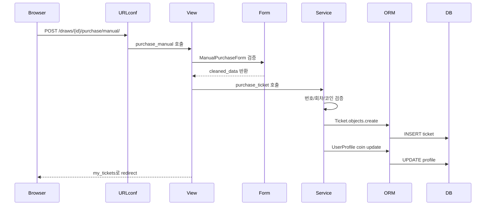

이 과정을 통해 Django에서 하나의 기능이 URL, View, Form, Service, ORM, Template을 거쳐 완성된다는 점을 이해하였다.

---

## 5. 데이터 모델 설계

### 5.1 ERD

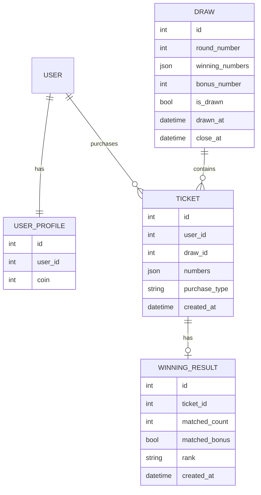

### 5.2 모델별 책임

#### UserProfile

Django 기본 User 모델을 확장하기 위해 OneToOne 관계로 연결하였다. 사용자의 코인 잔액을 저장한다.

#### Draw

로또 회차를 표현한다. 회차 번호, 판매 마감 시간, 추첨 여부, 당첨 번호, 보너스 번호, 추첨 시간을 저장한다.

#### Ticket

사용자가 구매한 티켓을 저장한다. 번호 6개는 JSONField로 저장하며, 구매 방식은 `MANUAL`, `AUTO`, `ML` 중 하나이다.

#### WinningResult

추첨 이후 티켓별 당첨 결과를 저장한다. 티켓과 OneToOne 관계를 가지므로 하나의 티켓에는 하나의 결과만 생성된다.

---

## 6. 핵심 비즈니스 로직

### 6.1 서비스 계층 분리

본 프로젝트는 View에 모든 로직을 작성하지 않고, 핵심 비즈니스 규칙을 `services.py`로 분리하였다. 이 방식은 실무에서 유지보수성과 테스트 가능성을 높이기 위해 자주 사용하는 구조이다.

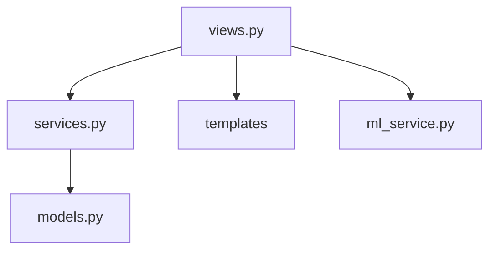

### 6.2 구매 처리 흐름

사용자가 티켓을 구매할 때는 다음 검증을 수행한다.

1. 번호가 정확히 6개인지 확인
2. 번호 중복 여부 확인
3. 번호가 1 이상 45 이하인지 확인
4. 구매 방식이 유효한지 확인
5. 회차가 추첨 완료 또는 판매 마감 상태인지 확인
6. 사용자 코인이 충분한지 확인
7. 티켓 생성 후 코인 차감

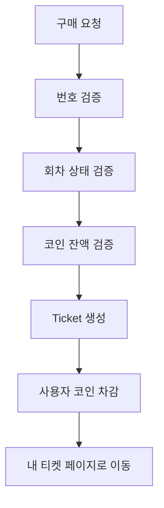

### 6.3 추첨 처리 흐름

관리자가 추첨을 실행하면 서버는 당첨 번호와 보너스 번호를 생성하고, 해당 회차의 모든 티켓에 대해 당첨 결과를 계산한다.

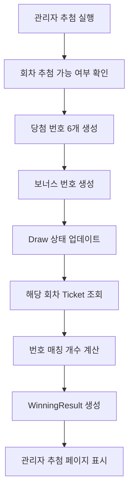

### 6.4 당첨 등수 계산 기준

| 조건 | 결과 |
|---|---:|
| 6개 번호 일치 | 1등 |
| 5개 번호 + 보너스 번호 일치 | 2등 |
| 5개 번호 일치 | 3등 |
| 4개 번호 일치 | 4등 |
| 3개 번호 일치 | 5등 |
| 그 외 | 낙첨 |

---

## 7. ML 추천 기능 설계

### 7.1 ML 기능의 목적

ML 추천 구매는 과거 당첨 번호 데이터를 기반으로 일반 랜덤 구매와 다른 번호 조합을 제안하는 기능이다. 로또는 확률적으로 독립적인 무작위 추첨이므로, 본 기능은 당첨 예측 모델이 아니라 **추천 방식의 다양화**를 위한 실험적 기능이다.

### 7.2 ML 추천 처리 구조

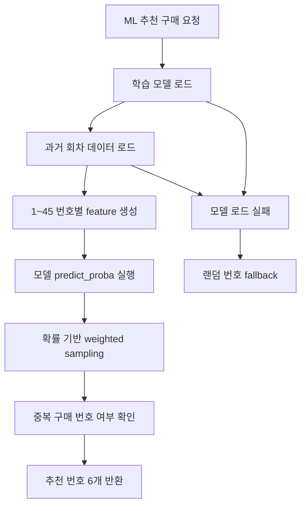

### 7.3 Feature 설계

ML 추천에서는 번호별 특징을 구성하기 위해 다음 feature를 사용하였다.

| Feature | 설명 |
|---|---|
| `target_number` | 추천 대상 번호 |
| `recent_5_count` | 최근 5회 등장 횟수 |
| `recent_10_count` | 최근 10회 등장 횟수 |
| `recent_20_count` | 최근 20회 등장 횟수 |
| `total_count` | 전체 데이터 등장 횟수 |
| `rounds_since_last_seen` | 마지막 등장 이후 지난 회차 수 |
| `is_odd` | 홀수 여부 |
| `number_group` | 번호 구간 그룹 |

### 7.4 안정성 설계

ML 모델 또는 데이터 파일 로드에 실패하더라도 서비스 전체가 중단되지 않도록 fallback 로직을 적용하였다.

```python
try:
    model_bundle = load_model_bundle()
    ...
    return recommended_numbers
except Exception:
    return generate_random_numbers()
```

또한 `pandas`, `joblib`과 같은 ML 의존성은 Django 앱 import 시점이 아니라 ML 추천 함수 실행 시점에 로드하도록 변경하였다. 이를 통해 ML 패키지가 설치되지 않은 상황에서도 기본 웹 화면과 관리자 기능을 검증할 수 있다.

---

## 8. 사용자 플로우

### 8.1 전체 사용자 플로우

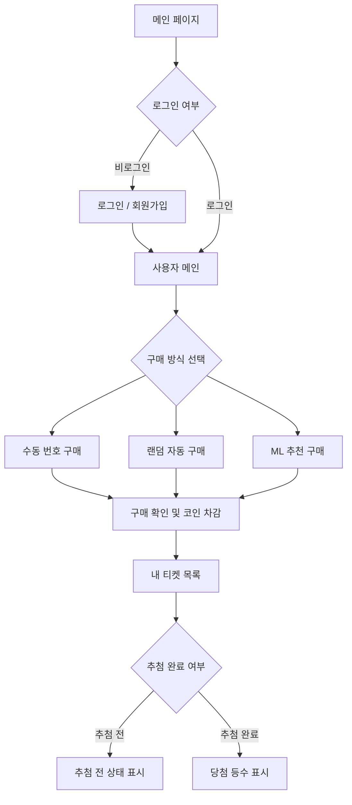

### 8.2 비로그인 홈 화면


비로그인 상태에서는 서비스 소개, 로그인/회원가입 버튼, 현재 회차 정보, 구매 방식 카드가 표시된다. 구매 버튼은 화면에 노출되지만 실제 구매는 로그인 후 가능하도록 서버 측에서 `login_required`로 보호한다.

### 8.3 로그인 화면


로그인 화면은 사용자 이름과 비밀번호를 입력받는다. 전체 UI는 홈 화면과 같은 디자인 시스템을 사용하여 서비스 일관성을 유지하였다.

### 8.4 로그인 후 홈 화면


로그인 후에는 사용자명, 보유 코인, 구매 비용 정보가 표시된다. 사용자는 이 화면에서 수동 구매, 랜덤 자동 구매, ML 추천 구매 중 하나를 선택할 수 있다.

### 8.5 최근 추첨 결과 및 관리자 바로가기

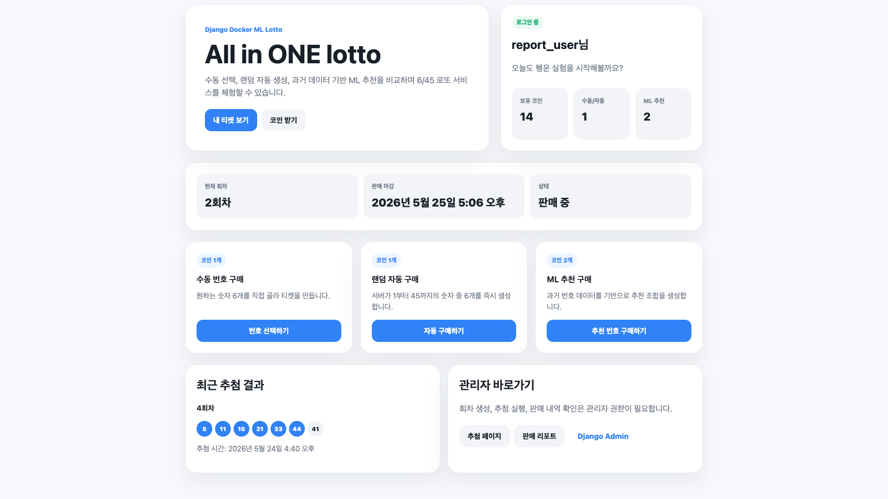

홈 하단에는 최근 추첨 결과를 보여준다. 관리자 계정으로 로그인한 경우 회차 생성, 추첨 실행, 판매 리포트로 이동할 수 있는 링크가 함께 제공된다.

### 8.6 수동 번호 구매

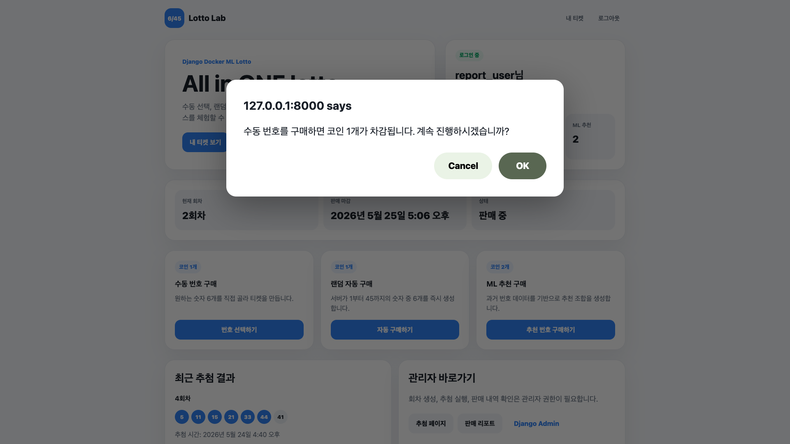

수동 번호 구매 버튼을 누르면 코인 차감 안내 confirm 창을 표시한다. 이는 사용자가 비용이 발생하는 액션을 명확히 인지한 뒤 구매하도록 하기 위한 UX 처리이다.

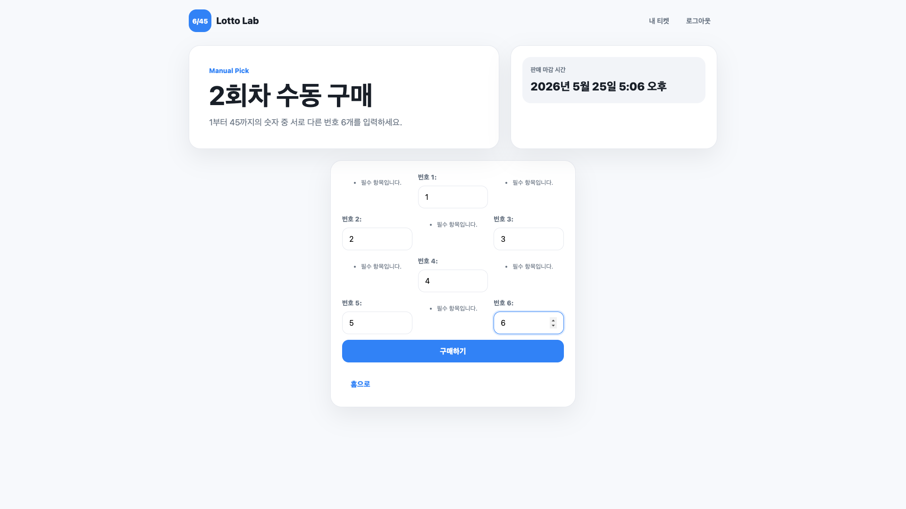

수동 번호 입력 화면에서는 서로 다른 번호 6개를 입력한다. Django Form에서 min/max 검증과 중복 번호 검증을 수행한다.

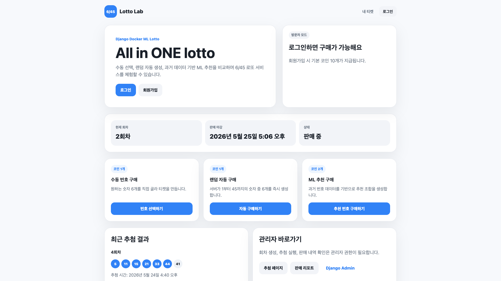

구매가 완료되면 내 티켓 목록으로 이동하고, 성공 메시지와 구매한 번호가 표시된다.

### 8.7 랜덤 자동 구매


랜덤 자동 구매는 서버에서 `random.sample(range(1, 46), 6)`을 사용해 번호를 생성한다. 구매 완료 후 생성된 번호가 메시지와 티켓 목록에 표시된다.

### 8.8 ML 추천 구매

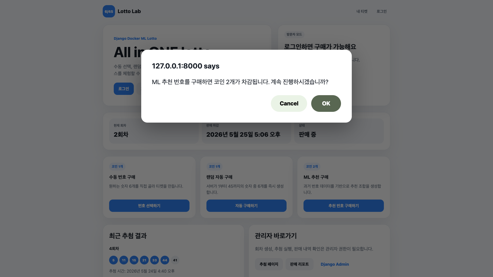

ML 추천 구매는 일반 구매보다 높은 비용인 코인 2개를 차감한다. 구매 전 confirm 창으로 비용 차감을 안내한다.


ML 추천 구매가 완료되면 추천 번호가 메시지로 표시되고, 티켓 목록에서는 구매 방식이 `ML 추천`으로 구분된다.

### 8.9 내 티켓 목록


내 티켓 목록에서는 회차, 구매 번호, 구매 방식, 구매 시간, 추첨 상태를 확인할 수 있다. 추첨 전 티켓은 `추첨 전`으로 표시되고, 추첨 완료 후에는 등수와 맞은 개수, 보너스 번호 일치 여부가 표시된다.

---

## 9. 관리자 플로우

### 9.1 관리자 전체 플로우

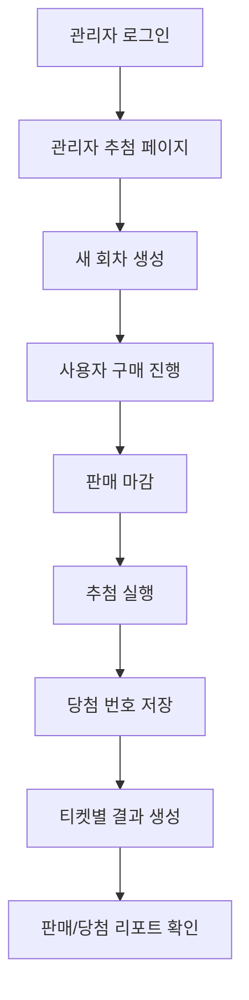

### 9.2 관리자 페이지 접근 제어

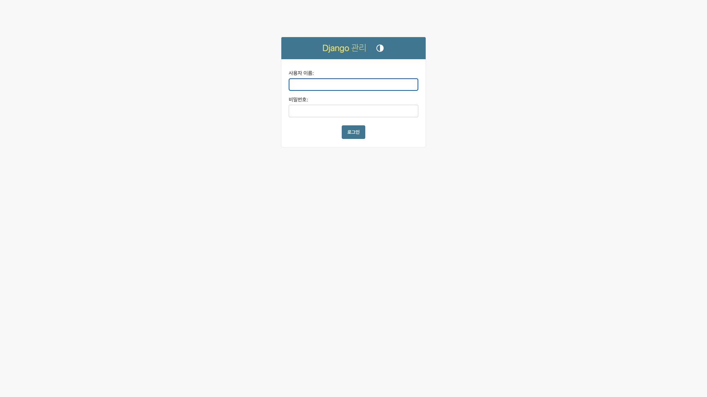

관리자 기능은 `staff_member_required` 데코레이터로 보호한다. 일반 사용자가 관리자 페이지에 접근하면 권한이 없다는 메시지가 표시된다.

### 9.3 Django Admin 모델 관리

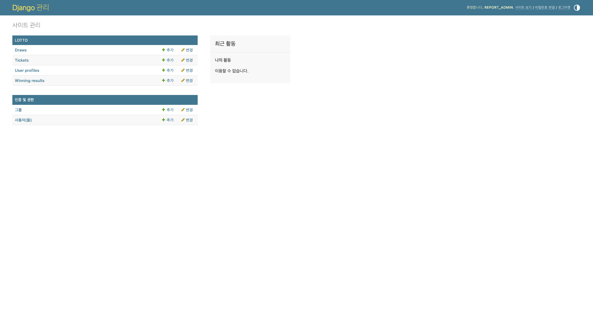

Django 기본 관리자 페이지에서는 `Draw`, `Ticket`, `UserProfile`, `WinningResult` 모델을 직접 확인하고 관리할 수 있다. 이는 개발 및 테스트 단계에서 데이터를 빠르게 확인하는 용도로 활용하였다.

### 9.4 관리자 추첨 페이지


관리자 추첨 페이지에서는 회차 목록, 마감 시간, 추첨 상태, 당첨 번호, 보너스 번호를 표 형태로 확인할 수 있다. 추첨 전 회차에는 `추첨 실행` 버튼이 표시된다.

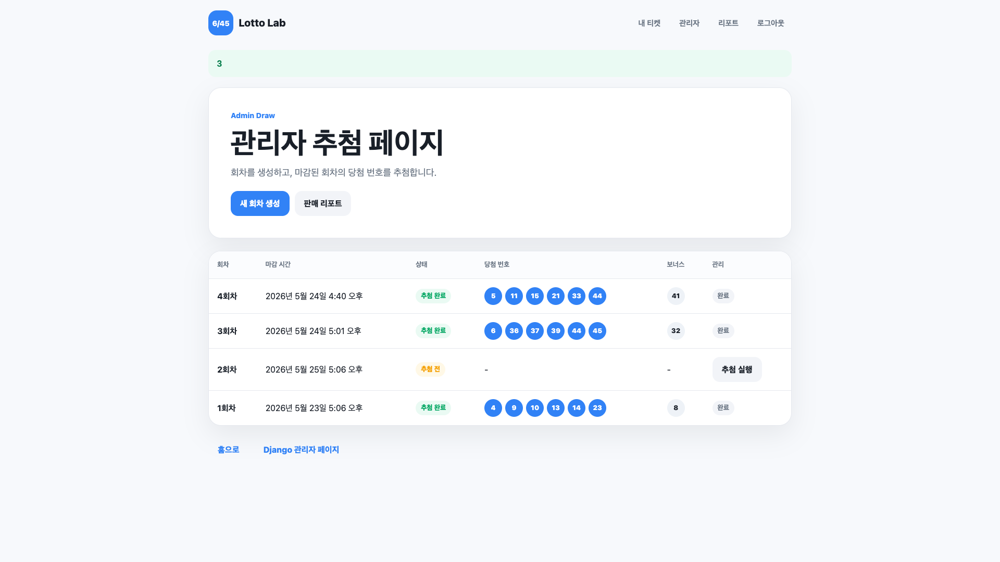

추첨 완료 후에는 당첨 번호와 보너스 번호가 로또 공 UI로 표시되고, 해당 회차의 상태가 `추첨 완료`로 변경된다.

### 9.5 판매/당첨 리포트


판매 리포트에서는 회차별 전체 판매량, 구매 방식별 판매량, 결과 생성 수, 등수별 결과 수를 확인할 수 있다. 이 화면을 통해 관리자는 특정 회차의 운영 현황을 한눈에 파악할 수 있다.

---

## 10. UI/UX 설계

### 10.1 디자인 방향

초기 구현 화면은 기능 중심의 기본 HTML 구조였지만, 최종 버전에서는 Toss 스타일의 간결하고 신뢰감 있는 UI로 개선하였다.

주요 디자인 원칙은 다음과 같다.

- 흰색 카드와 연한 회색 배경으로 정보 영역 분리
- 파란색 CTA 버튼으로 핵심 액션 강조
- 로또 번호는 원형 ball 컴포넌트로 시각화
- 관리자 화면은 표 기반으로 데이터 스캔이 쉽도록 구성
- 메시지는 성공/경고 상태에 따라 배경색을 구분

### 10.2 공통 레이아웃

`base.html`을 추가하여 모든 화면에서 공통 헤더, 내비게이션, 메시지 영역을 재사용하도록 개선하였다.

```text
base.html
├── header
│   ├── Lotto Lab logo
│   └── navigation
├── messages
└── content block
```

### 10.3 스타일 시스템

`styles.css`에는 다음 컴포넌트를 정의하였다.

| 컴포넌트 | 용도 |
|---|---|
| `.hero-panel` | 주요 페이지 타이틀 영역 |
| `.card` | 정보 묶음 표시 |
| `.button` | 주요 액션 버튼 |
| `.badge` | 상태 표시 |
| `.ball` | 로또 번호 표시 |
| `.table-card` | 관리자 데이터 테이블 |
| `.message` | 성공/오류 알림 |

---

## 11. 구현 과정

### 11.1 Django 프로젝트 초기 구성

Django 프로젝트와 `lotto` 앱을 생성한 뒤 URL, View, Template 구조를 연결하였다. 이후 PostgreSQL 연결을 위해 `.env` 기반 환경변수 설정을 적용하였다.

이 단계에서 학습한 핵심은 Django 프로젝트 전체가 `config` 프로젝트 설정과 `lotto` 앱 기능으로 나뉜다는 점이다. `config/settings.py`는 프로젝트 전체 설정을 담당하고, `lotto` 앱은 실제 도메인 기능을 담당하도록 구성하였다.

### 11.2 Docker multi-container 구성

`docker-compose.yml`을 작성하여 Django 서버와 PostgreSQL 데이터베이스를 분리하였다. ML 학습 환경은 `Dockerfile.ml`을 기반으로 별도 컨테이너로 구성하였다.

Docker 학습 과정에서는 다음 순서로 실행 환경을 확인하였다.

1. Django 단독 실행으로 기본 서버 동작 확인
2. PostgreSQL 컨테이너 추가
3. `.env`를 통해 Django DB 설정을 PostgreSQL로 변경
4. `docker compose up`으로 web/db 동시 실행 확인
5. ML 전용 Dockerfile과 컨테이너 추가

이를 통해 로컬 실행 환경과 컨테이너 실행 환경의 차이, DB host가 로컬에서는 `localhost`이지만 Docker Compose 내부에서는 서비스 이름인 `db`가 된다는 점을 이해하였다.

### 11.3 도메인 모델 구현

회차, 티켓, 사용자 프로필, 당첨 결과 모델을 정의하고 migration을 적용하였다. 구매 번호는 JSONField로 저장하여 리스트 형태의 번호 6개를 자연스럽게 다룰 수 있도록 하였다.

Django ORM을 사용하면서 SQL을 직접 작성하지 않아도 Python 클래스 기반으로 테이블을 설계하고, migration을 통해 DB 스키마 변경을 추적할 수 있다는 점을 학습하였다.

### 11.4 구매 기능 구현

수동 구매는 Django Form을 사용하여 번호 입력을 검증하였다. 자동 구매는 Python의 `random.sample`로 번호를 생성하였다. ML 추천 구매는 `ml_service.py`를 통해 추천 번호를 생성한 뒤 공통 구매 로직인 `purchase_ticket`을 호출한다.

구매 기능에서는 `GET`과 `POST` 요청의 역할 차이를 학습하였다. 수동 구매 화면 진입은 `GET`, 실제 구매 처리는 `POST`로 분리하였고, Django의 CSRF 보호를 위해 모든 구매 form에 ``을 포함하였다.

### 11.5 추첨 및 당첨 결과 구현

관리자가 추첨을 실행하면 당첨 번호와 보너스 번호를 생성하고, 해당 회차의 티켓을 순회하며 `WinningResult`를 생성한다.

### 11.6 UI 개선

각 페이지에 흩어져 있던 HTML 구조를 공통 base template 기반으로 정리하였다. 이후 Toss 스타일의 카드형 레이아웃과 반응형 CSS를 적용하여 서비스 완성도를 높였다.

### 11.7 리포트 기능 개선

관리자 판매 리포트에서는 회차별 티켓 수, 수동/자동/ML 구매 수, 결과 생성 수, 등수별 집계를 제공한다. ML 구매 수 집계가 회차별로 계산되도록 수정하였다.

---

## 12. 테스트 결과

### 12.1 실행한 검증 명령

```bash
python manage.py check
python manage.py test
```

### 12.2 검증 결과

| 검증 항목 | 결과 |
|---|---:|
| Django system check | 통과 |
| Template loading check | 통과 |
| Unit test discovery | 테스트 0개 발견 |

현재 프로젝트에는 Django 테스트 케이스가 아직 충분히 작성되어 있지 않다. 따라서 `manage.py test`는 정상 실행되지만 발견되는 테스트는 0개이다. 기능 검증은 브라우저 기반 수동 테스트로 수행하였다.

### 12.3 수동 테스트 시나리오

| 시나리오 | 입력/동작 | 기대 결과 | 결과 |
|---|---|---|---:|
| 회원가입 | 사용자 계정 생성 | 로그인 후 홈 이동 | 통과 |
| 로그인 | 사용자 이름/비밀번호 입력 | 로그인 성공 | 통과 |
| 수동 구매 | 번호 6개 입력 | 티켓 생성, 코인 1개 차감 | 통과 |
| 자동 구매 | 자동 구매 버튼 클릭 | 랜덤 번호 티켓 생성 | 통과 |
| ML 구매 | ML 추천 구매 버튼 클릭 | 추천 번호 티켓 생성, 코인 2개 차감 | 통과 |
| 회차 생성 | 관리자 새 회차 생성 | 회차 번호 자동 증가 | 통과 |
| 추첨 실행 | 관리자 추첨 실행 | 당첨 번호/보너스 번호 저장 | 통과 |
| 내 티켓 확인 | 티켓 목록 조회 | 회차별 티켓과 결과 표시 | 통과 |
| 판매 리포트 | 관리자 리포트 조회 | 회차별 판매량 표시 | 통과 |

### 12.4 추가로 작성하면 좋은 자동화 테스트

향후 다음 테스트를 추가하면 프로젝트 안정성을 더 높일 수 있다.

- 번호가 6개가 아닐 때 구매 실패
- 중복 번호 입력 시 구매 실패
- 판매 마감 후 구매 실패
- 코인이 부족할 때 구매 실패
- 추첨 완료 회차 재추첨 실패
- 1등~5등/낙첨 계산 함수 테스트
- ML 모델 로드 실패 시 랜덤 fallback 테스트

---

## 13. GitHub 링크

소스 코드는 다음 GitHub 저장소에 업로드하였다.

[GitHub Repository: carolyn0515/lotto](https://github.com/carolyn0515/lotto)

---

## 14. AI 도구 사용 내역

본 프로젝트에서는 AI 도구를 제한적인 보조 목적으로 사용하였다. 핵심 기능 구현과 Docker/Django 학습 과정은 직접 수행하였으며, AI 도구는 주로 코드 점검과 화면 디자인 개선에 활용하였다.

| 사용 영역 | 사용 내용 |
|---|---|
| 코드 점검 | Django View, 서비스 로직, ML 의존성 import 구조, 관리자 리포트 집계 로직 점검 |
| 디자인 개선 | 기존 HTML 화면을 Toss 스타일의 카드형 UI로 개선하는 작업 보조 |
| UI 구조 정리 | 공통 `base.html`, 정적 CSS 파일, 버튼/카드/테이블 스타일 구성 보조 |
| 보고서 정리 | 구현 내용과 화면 캡처가 잘 매칭되도록 문서 구조와 다이어그램 정리 보조 |

AI 도구는 프로젝트 전체를 자동 생성하는 용도가 아니라, 작성한 코드의 문제점을 점검하고 사용자 화면의 완성도를 높이기 위한 보조 도구로 사용하였다. 실제 Docker 실행, Django 구조 이해, 기능 구현 흐름 파악, 오류 확인, 테스트 수행, 코드 반영 여부 판단은 개발자가 직접 수행하였다.

---

## 15. 한계점 및 개선 방향

### 15.1 한계점

- 로또 번호는 무작위 추첨이므로 ML 추천 기능이 실제 당첨 확률을 의미 있게 높인다고 볼 수 없다.
- 현재 자동화 테스트가 부족하여 주요 기능에 대한 회귀 테스트가 충분하지 않다.
- 실제 결제/광고 시스템은 구현하지 않고 가상 코인과 가상 광고 보상으로 대체하였다.
- 관리자 기능은 별도 대시보드를 구현했지만, 일부 데이터 수정은 Django Admin에 의존한다.

### 15.2 개선 방향

- Django TestCase 기반 자동화 테스트 추가
- Celery와 Redis를 활용한 ML 모델 학습 비동기 처리
- 관리자 통계 차트 추가
- REST API 분리 후 React/Vue 기반 프론트엔드 적용
- 실제 로또 공개 데이터 수집 자동화
- 회차별 매출, 사용자별 구매 패턴, 추천 방식별 성과 비교 대시보드 구현

---

## 16. 결론

Lotto Lab은 Django와 Docker를 기반으로 일반 사용자와 관리자가 함께 사용하는 6/45 로또 웹 서비스를 구현한 프로젝트이다. 사용자는 수동, 랜덤 자동, ML 추천 방식으로 티켓을 구매할 수 있으며, 관리자는 회차 생성, 추첨 실행, 판매 및 당첨 내역 확인 기능을 사용할 수 있다.

본 프로젝트의 핵심 성과는 다음과 같다.

- Docker Compose 기반 multi-container 환경 구성
- Django ORM을 활용한 도메인 모델 설계
- 서비스 계층 분리를 통한 구매/추첨/당첨 계산 로직 구현
- ML 모델 산출물을 웹 서비스에 연결하는 추천 기능 구현
- 관리자 리포트와 사용자 티켓 조회 기능 구현
- Toss 스타일 UI 개선을 통한 완성도 높은 사용자 경험 제공

결과적으로 본 프로젝트는 단순한 로또 예제 구현을 넘어, 웹 백엔드 서비스 개발에서 필요한 인증, 데이터 모델링, 비즈니스 로직 분리, 컨테이너 환경 구성, ML 기능 연동, 관리자 리포트 구현까지 포함한 종합적인 학습 프로젝트로 완성되었다.

---

## 부록 A. 화면 캡처 파일명 매핑

보고서에 사용한 화면 이미지는 `report/images/` 디렉터리에 다음 이름으로 정리한다.

| 파일명 | 설명 |
|---|---|
| `01_home_guest.png` | 비로그인 홈 화면 |
| `02_login.png` | 로그인 화면 |
| `03_home_logged_in.png` | 로그인 후 홈 화면 |
| `04_latest_draw_and_admin_shortcuts.png` | 최근 추첨 결과 및 관리자 바로가기 |
| `05_admin_draw_list.png` | 관리자 추첨 페이지 |
| `06_admin_draw_after_run.png` | 추첨 완료 후 관리자 페이지 |
| `07_admin_sales_report.png` | 관리자 판매/당첨 리포트 |
| `08_my_tickets.png` | 내 티켓 목록 |
| `09_manual_confirm.png` | 수동 구매 confirm |
| `10_manual_purchase_form.png` | 수동 번호 입력 화면 |
| `11_manual_purchase_success.png` | 수동 구매 완료 |
| `12_auto_purchase_success.png` | 자동 구매 완료 |
| `13_ml_confirm.png` | ML 구매 confirm |
| `14_ml_purchase_success.png` | ML 구매 완료 |
| `15_django_admin_permission_denied.png` | Django 관리자 접근 제한 |
| `16_django_admin_models.png` | Django Admin 모델 목록 |
